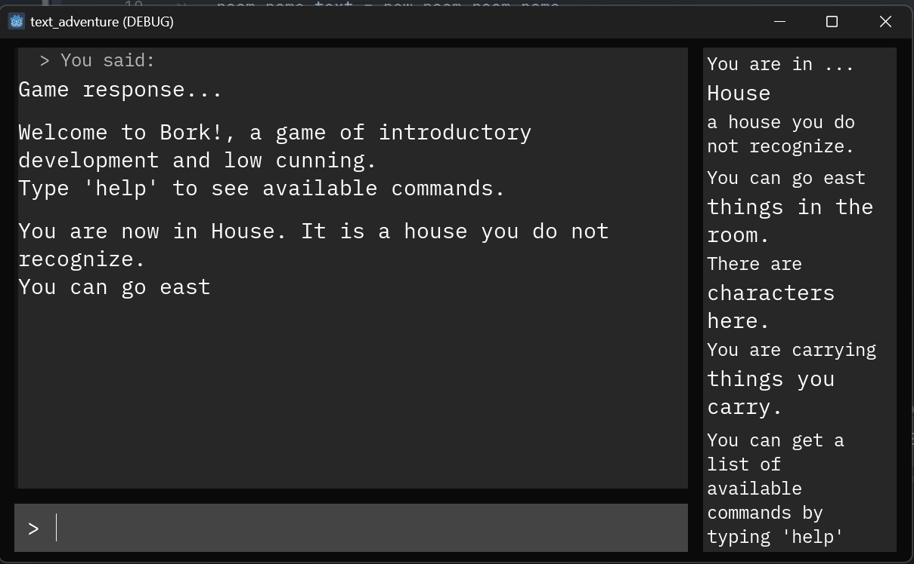

# Text Adventure Game Using Godot Engine

This project is intended to help beginning to intermediate level developers learn to work with the Godot Engine to create a text adventure game. 

A sample game is provided. The project assumes a familiarity with programming and a basic understanding of Godot Engine classes and scripting.

There is much room for improvement, which is the point after all.

## Primary scenes and classes

### MainScene.tscn

The MainScene and its accompanying script MainScene.gd control the overall flow of the game. MainScene extends Control. The script contains references to the player, a command processor, room manager, and the various output panels.

Developers seeking to understand the structure of the project would do well to start here.

### Player.tscn

The Player scene inherits from Node. It primarily functions as a container for the Player.gd script. The script defines player actions like taking and dropping items and managing inventory.

Notably, moving from room to room is not a part of the player class. This is managed by the Command Processor.

### CommandProcessor.tscn

The CommandProcessor scene, like the Player, is primarily a Node container for the CommandProcessor script. This script encapsulates much of the work in the sample game, interpreting player input and responding accordingly.

The core functionality if contained in teh process_command function, which takes the player input string as an argument and returns either an error/clarification message to be printed or the result of a function call. There is a single function for each valid command. 

### RoomManager.tscn

RoomManager is also currently defined as a Node container for the RoomManager script. In its current form, functionality is limited to loading exit, item, and NPC resources into a room at startup.

## User Interface

The UI consists of a large OutputPanel, a smaller InputArea for player input, and a SidePanel. The SidePanel is intended to give the player an easy reference to the current state of the game and the help command. Each component (or one of its subcomponents) has a script to manage text input and output. A number of containers and other layout elements manage the size and placement of the elements.